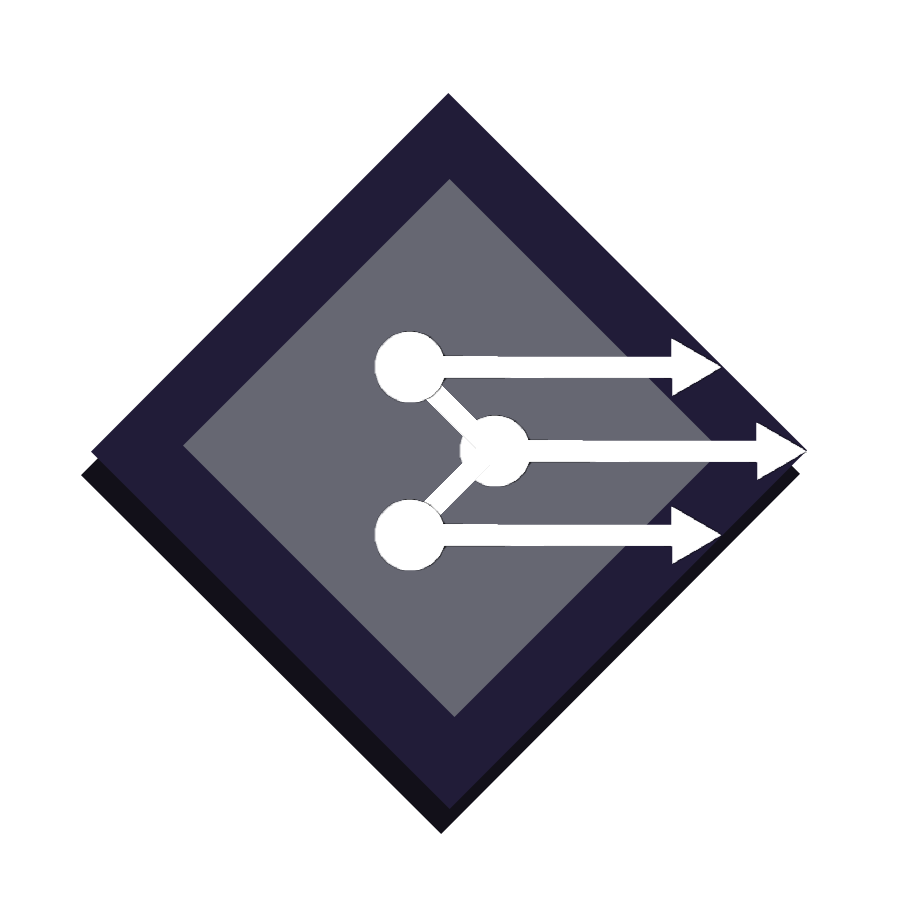

# Система управления проектами "Менеджер Проектов"
Построение собственной системы управления проектами. Основной функциональностью этой системы будет управление задачами разных проектов с разной приоритетностью, прикрепление к каждой задаче необходимых файлов и документации, организация команды и работа в режиме онлайн-взаимодействия между участниками проекта, контроль выполнения задач и сроков.
# 
База данных будет предоставлена в 3 нф, так как данные подходят под её определение
